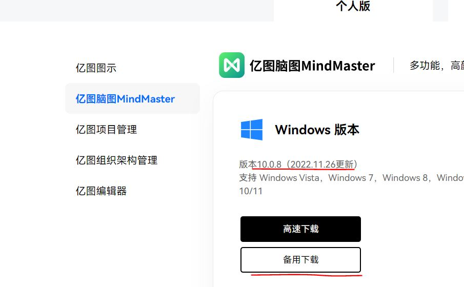
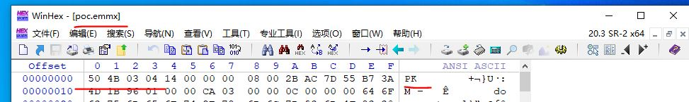
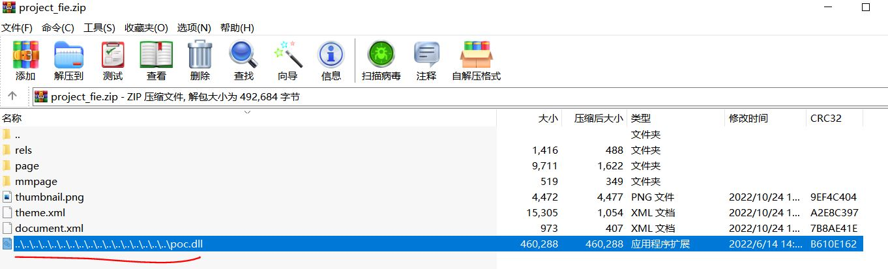
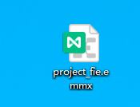
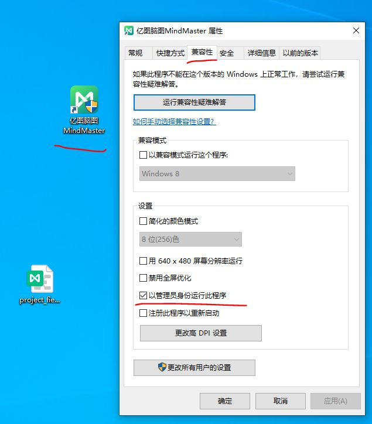
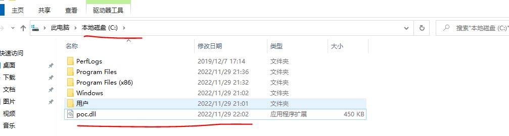

#  
 Vulnerability description

 There is a zipslip vul in MindMaster when open MindMaster project file ***.emmx

#  
 Software version

Ver 10.0.8（2022.11.26update）

# 
 Software web

https://www.edrawsoft.cn/download/?type=1&tab=2

# 
 Software Download link

https://cc-download.edrawsoft.cn/origin/mindmaster_cn_full5375.exe?_gl=1*16kqd32*_ga*MTU0ODQ4MzQuMTY2NzU0MzI5MA..*_ga_24WTSJBD5B*MTY2OTcyNzIxMS4yLjEuMTY2OTcyNzI2Ni41LjAuMA..

# 
 Recurrennt enviorment

Win10

MindMaster Ver 10.0.8 

# 
 Recurrennt

 1.Open project file **.emmx with WinHex. File Head is Zip format.

  

  

 2.So,Rename **.emmx to **.zip . Add ../../../../../../../../../../../../../../../../../poc.dll  file into **.zip file use python code 

  

 3.Rename **.zip(Crafted) to **.emmx 

  

  

 5.MindMaster need Administrator permissions to release file to c:\ 

  

  

 6.Open project_fie.emmx and Open c:\ 

  

  

 7.Recurrent Sucessed!

